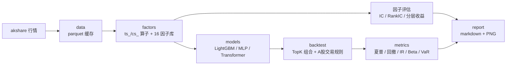
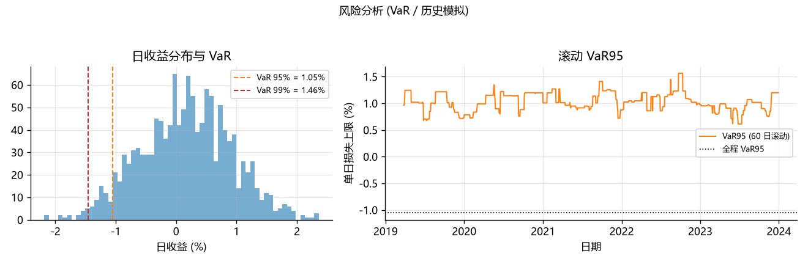
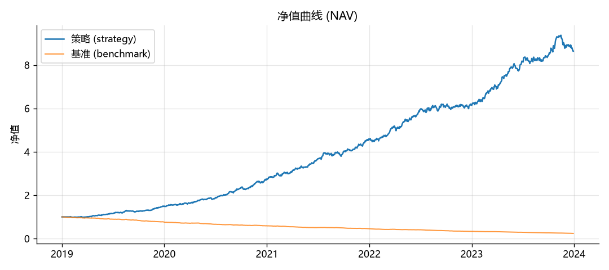
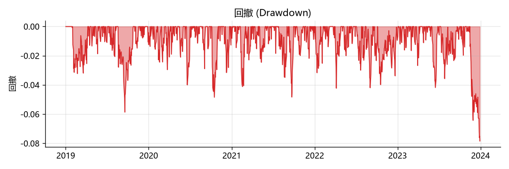
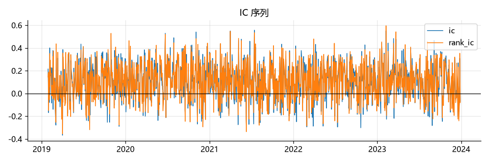
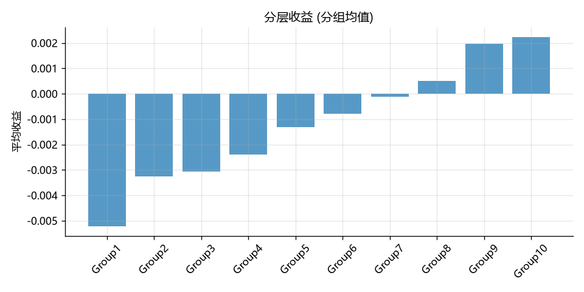

# QuantLab · A 股多因子量化研究流水线

[](https://www.python.org/)
[](https://docs.astral.sh/uv/)
[](https://opensource.org/license/mit)

---

## 目录

- [项目简介](#项目简介)
- [核心特性](#核心特性)
- [整体架构](#整体架构)
- [快速上手](#快速上手)
- [报告输出](#报告输出)
- [成果展示](#成果展示)
- [内置因子库](#内置因子库)
- [模型](#模型)
- [回测与交易规则](#回测与交易规则)
- [风险指标与压力测试](#风险指标与压力测试)
- [配置说明](#配置说明)
- [项目结构](#项目结构)
- [工程质量](#工程质量)
- [工作流（CI）](#工作流ci)
- [环境要求 / 常见问题](#环境要求--常见问题)
- [路线图](#路线图)

---

## 项目简介

QuantLab 是我自己维护的一套 A 股多因子研究流水线，从行情数据、因子计算与评估、
模型训练、策略回测到报告输出，每段单独成模块，既可以各自调用，也可以一键跑完整条链路。

写它的起因是之前几个小项目里踩过的坑：数据源动不动就要付费、回测基本不算手续费和
涨跌停、因子算完没有一个统一的评价口径、代码过两周自己也懒得看。这个仓库主要把
四个问题补上了：

1. 数据免费可复现 —— akshare 拉行情，parquet 做本地缓存，同一段数据只下载一次；
2. 因子有统一的评价口径 —— IC / RankIC / ICIR / 分层收益，polars 向量化计算，秒级出结果；
3. 回测贴近真实交易 —— 日频循环里实现了 T+1、100 股整手、佣金 / 印花税 / 过户费、滑点、涨跌停；
4. 代码结构清晰、可维护 —— 全程类型标注，ruff / mypy / pytest 把关，CI 每次 push 自动跑。

## 核心特性

| 维度 | 实现 |
| --- | --- |
| 数据引擎 | `polars` 列式引擎，长表布局 `[date, instrument, ...]`，parquet 存储 |
| 数据源 | `akshare`（免费、无 token），后复权，逐股限速 + 重试 |
| 配置 | `pydantic v2` 类型化配置，YAML 驱动，非法配置直接报错 |
| 因子 | 16 个内置 alpha 因子，`ts_*`（时序）与 `cs_*`（横截面）算子 |
| 因子评估 | IC / RankIC / ICIR / t 值 / 分层收益 / 换手率（向量化，秒级） |
| 模型 | LightGBM（主力基线）+ PyTorch MLP / FT-Transformer |
| 回测 | 日频循环，T+1 / 100 股整数手 / 佣金 / 印花税 / 过户费 / 滑点 / 涨跌停 |
| 指标 | 夏普 / 索提诺 / 卡玛 / 信息比率 / 最大回撤 / Beta / Alpha / VaR / CVaR |
| 报告 | 自动生成 `report.md` + 净值 / 回撤 / 风险分析 / IC / 分层收益 PNG |
| 工程 | `uv` 依赖管理，`ruff` + `mypy` + `pytest`，CI 自动校验 |

## 整体架构



各阶段通过 `configs/*.yaml` 统一驱动，可单独调用：

```text
configs/*.yaml
      │  load_config()
      ▼
1. data      AkshareSource.get_daily() ──► parquet 缓存（缓存命中则跳过下载）
      ▼
2. factors   compute_factors() → standardize() → forward_return()（标签）
      ▼
3. models    fit_predict()：按时序切分 train/valid/test，早停，样本外预测
      ▼
4. backtest  run_backtest()：日频循环 + 交易规则 → 净值 / 成交 / 换手
      ▼
5. report    metrics.summary() + risk_metrics() + render_report()
            → reports/<时间戳>/（含 VaR/CVaR、压力测试章节与图表）
```

## 快速上手

### 环境准备

```bash
# 1. 安装 uv（若尚未安装）
python -m pip install uv

# 2. 安装依赖并创建虚拟环境
uv sync

# 3.（仅 ARM 设备 / 较老 CPU 需要）Polars 默认运行库要求 AVX2，会直接崩溃：
#    用这条命令加装官方兼容运行时即可
uv sync --extra rtcompat
```

### 运行真实行情 demo

```bash
# 首次会下载沪深300成分股行情（约 1~2 分钟），之后走缓存秒级加载
uv run python examples/run_research.py --config configs/baseline.yaml
```

> 想更快跑通，把 `configs/baseline.yaml` 里的 `data.universe` 改成少量代码，例如
> `"600519,000858,601318,000333,600036"`。

### 离线演示（无需网络）

akshare 上游不可达（代理没开、网络受限）或 CI 需要完全离线冒烟测试时，
用内置的合成行情生成器跑同一条流水线：

```bash
# 1. 生成合成行情（内嵌动量信号，缓存到 data/）
uv run python examples/make_synthetic.py --n-stocks 30

# 2. 跑通全流程（命中缓存，跳过下载）
uv run python examples/run_research.py --config configs/synthetic.yaml
```

### 模型切换

在配置中改 `model.name` 即可切换：

```yaml
model:
  name: "lgbm"        # 或 "mlp" / "transformer"
```

## 报告输出

每次运行会在 `reports/<时间戳>/` 下生成自包含报告：

```text
reports/20260908_000753/
├── report.md          # 指标汇总 + 风险指标 + 压力测试（Markdown）
├── nav.png            # 净值曲线（策略 vs 基准）
├── drawdown.png       # 回撤曲线
├── risk.png           # 风险分析：日收益分布 + VaR / 滚动 VaR95
├── ic.png             # IC 序列
└── group_return.png   # 分层收益（10 组）
```

完整的指标表与图表见下方 [成果展示](#成果展示)。

## 成果展示

下面是一次离线合成数据 demo（`configs/synthetic.yaml`，单因子 `momentum_20`，40 只股票 /
2019–2023 / 1,304 个交易日）的完整输出，包含收益表现、风险指标和压力测试。
合成数据里人为嵌入了动量信号，所以下面的指标明显偏乐观；这里只用来演示流水线和报告长什么样，
不代表真实市场的收益水平。

### 回测表现

| 指标 | 数值 | 指标 | 数值 |
| --- | --- | --- | --- |
| 累计收益 | 763.78% | 夏普比率 | 3.56 |
| 年化收益 | 51.74% | 索提诺比率 | 3.79 |
| 年化波动率 | 11.92% | 卡玛比率 | 6.60 |
| 最大回撤 | 7.84% | 日胜率 | 58.79% |
| 信息比率 | 6.56 | Beta | 0.99 |
| Alpha(年化) | 100.34% | — | — |

### 风险指标与压力测试

| 风险指标 | 数值 |
| --- | --- |
| VaR (95%, 1 日) | 1.05% |
| VaR (99%, 1 日) | 1.46% |
| CVaR / ES (95%) | 1.35% |
| CVaR / ES (99%) | 1.72% |
| 最长水下时间 | 63 个交易日 |

| 压力情景 | 组合预估冲击 |
| --- | --- |
| 单日 -5% | -4.93% |
| 单日 -10% | -9.86% |
| 连续 3 日 -5% | -14.07% |
| 连续 5 日 -3% | -13.94% |

<p align="center">
  
</p>

### 净值与回撤

<p align="center">
  
</p>
<p align="center">
  
</p>

### 因子 IC 与分层收益

<p align="center">
  
</p>
<p align="center">
  
</p>

## 内置因子库

`factors/library.py` 内置 16 个 alpha 因子（参照 alpha158 的思路实现），按类别分组：

| 因子 | 说明 | 类别 |
| --- | --- | --- |
| `momentum_20` / `momentum_60` | 20 / 60 日区间收益 | 动量 |
| `reversal_5` | 5 日反转（负短期收益） | 反转 |
| `volatility_20` | 20 日日收益波动率 | 波动 |
| `wvma_20` | 20 日成交量加权波动率 | 波动 |
| `volume_ratio_20` | 20 日 / 60 日均量比 | 量能 |
| `turnover_20` | 20 日均换手率 | 量能 |
| `corr_cv_20` | 收盘价与对数成交量 20 日相关性 | 量价 |
| `beta_oc_20` | 开盘价对收盘价 20 日 Beta | 量价 |
| `rsi_14` | 相对强弱指标 RSI(14) | 振荡 |
| `macd` | MACD 柱 `2×(DIF−DEA)` | 振荡 |
| `rsv_20` | 20 日 RSV（KDJ 基础） | 振荡 |
| `cntp_20` | 20 日上涨天数占比 | 统计 |
| `sump_20` | 20 日涨幅占比 | 统计 |
| `kbar_kmid` | K 线位置 `close/open − 1` | K 线形态 |
| `kbar_klen` | K 线长度 `(high−low)/open` | K 线形态 |

算子分 `ts_*`（时序，`over(instrument)` 滚动）和 `cs_*`（横截面，`over(date)`）两类，
提供 `delay / delta / sum / mean / std / rank / zscore / corr / beta / decay / quantile`
等基础操作，想加新因子时基于这些算子组合就行。

## 模型

统一 `Model` 接口（`fit` / `predict` / `feature_importances`），三种实现：

| 模型 | 说明 | 特点 |
| --- | --- | --- |
| `LGBMModel` | LightGBM 回归，早停 | 默认主力，训练快，输出特征重要性 |
| `MLPModel` | 多层感知机 | 和 LightGBM 做对比，看深度模型的表现 |
| `TransformerModel` | FT-Transformer（表格 Transformer） | 试一下注意力机制在结构化数据上的效果 |

训练按日期顺序切分 train / valid / test（`train_end` / `valid_end`，默认按 60% / 80%
日期分位），样本外预测不会用到未来信息；torch 只在选到 MLP / Transformer 时才导入，
单跑 LightGBM 不会触发 torch 的加载开销。

## 回测与交易规则

回测引擎是日频 close-to-close 循环：每日生成目标权重 → 先卖后买（释放资金）→ 逐笔计费 →
收盘按市价记账。信号只使用当日已有的信息，没有前视偏差。

| 规则 | 取值 |
| --- | --- |
| T+1 | 当日买入次日方可卖出（日频调仓下自然满足） |
| 整数手 | 买入必须为 100 股整数倍 |
| 佣金 | 万 2.5，最低 5 元（双边） |
| 印花税 | 卖出 0.1% |
| 过户费 | 万 0.1（双边） |
| 滑点 | 成交价相对收盘价偏离万 5 |
| 涨跌停 | 涨停不可买、跌停不可卖 |

涨跌停幅度按板块区分：创业板（300/301）、科创板（688）为 20%，北交所（8xx/4xx）为 30%，
主板为 10%。

组合策略目前实现的是 TopK 等权：按当日预测值排序，持有前 `top_k` 比例的股票并等权分配
（换手思路参考了旧项目 `QlibTopKStrategy`）。

## 风险指标与压力测试

`metrics/risk.py` 在收益类指标之外补了风险度量，回答“这个组合到底可能亏多少”：

- **VaR（历史模拟）**：按回测期日收益分布取分位数，报 95% / 99% 置信度下 1 日损失幅度
  （取保守的 `higher` 分位，结果总是落在真实观测的日收益上）；
- **CVaR / Expected Shortfall**：超出 VaR 那一段尾巴的平均损失，衡量“最坏那几天平均亏多少”；
- **最长水下时间**：净值连续低于前期高点（未创新高）的最长交易日数；
- **滚动 VaR**：60 日窗口滚动计算 VaR95，看风险水平随时间的变化；
- **压力测试**：先对回测期策略日收益与基准日收益做 OLS 回归估计市场 Beta，再把
  “单日 -5% / -10%、连续 3 日 -5%、连续 5 日 -3%”等基准冲击映射成组合的预估冲击。

这些结果会进 CLI 输出和报告（`report.md` 的“风险指标 / 压力测试”小节 + `risk.png`）。

## 配置说明

实验参数都集中在 YAML 里，由 `config.py` 的 pydantic 模型校验。以 `baseline.yaml` 为例：

```yaml
data:
  universe: "000300"          # 指数成分（"000300"）或逗号分隔代码列表
  start_date: "2018-01-01"
  end_date: "2023-12-31"
  adjust: "hfq"               # 后复权

factors:
  names: [momentum_20, ...]   # 内置因子名列表
  normalize: "zscore"         # zscore / rank / scale / robust_zscore / none

model:
  name: "lgbm"                # lgbm / mlp / transformer
  label_horizon: 1            # 标签：未来 1 日收益
  params: { learning_rate: 0.05, num_leaves: 63 }

backtest:
  strategy: "topk"
  top_k: 0.2                  # 持有预测前 20% 的股票
  init_cash: 100000000
  commission_rate: 0.00025
  # ... 其余费率 / 滑点 / 涨跌停参数

report:
  output_dir: "reports"
```

## 项目结构

```text
quantlab/
├── configs/                    # 实验配置（baseline / smoke / synthetic）
├── examples/
│   ├── run_research.py         # 一键 demo：数据→因子→模型→回测→报告
│   └── make_synthetic.py       # 合成行情生成器（离线 / CI）
├── src/quantlab/
│   ├── config.py               # pydantic 配置模型 + YAML 加载
│   ├── data/                   # akshare 适配器 + parquet 缓存 + schema
│   ├── factors/
│   │   ├── operators.py        # ts_*/cs_* 算子（polars 实现）
│   │   ├── library.py          # 16 个内置因子
│   │   ├── evaluate.py         # IC / RankIC / 分层收益 / 换手
│   │   └── neutral.py          # 市值 / 行业中性化
│   ├── models/                 # 统一接口 + LightGBM + PyTorch + 训练切分
│   ├── backtest/               # A股规则 + 账户 + 组合策略 + 日频引擎
│   ├── metrics/                # 收益 / 回撤 / Beta-Alpha + VaR / CVaR / 压力测试（risk.py）
│   └── report/                 # markdown + matplotlib 图表（含风险分析图）
├── tests/                      # pytest（合成数据）
├── .github/workflows/ci.yml    # CI：lint + test
└── pyproject.toml              # uv + ruff + mypy + pytest 配置
```

## 工程质量

```bash
uv run ruff check .         # lint
uv run ruff format --check .  # 格式检查
uv run mypy src             # 静态类型检查
uv run pytest               # 单元测试（合成数据，覆盖算子/因子/回测/指标/VaR 压力测试）
```

CI（`.github/workflows/ci.yml`）在每次 push 时自动运行 lint + 类型检查 + 测试。

## 工作流（CI）

`.github/workflows/ci.yml` 在 push / PR 时自动执行：

```text
依赖安装    uv sync --dev
Lint        ruff check .
类型检查    mypy src
单元测试    pytest（合成数据）
离线 demo   生成合成行情 → 跑通全流程 → 上传报告为 artifact
```

最后一步用 `configs/synthetic.yaml`（`signal` 模型，不依赖原生 ML 库），在任何干净
环境里都能跑通并产出报告，用来验证整条流水线的可复现性。

## 环境要求 / 常见问题

- **数据下载报 `ProxyError` / `RemoteDisconnected`**：akshare 通过 `requests` 读取系统代理。
  如果本机开了 Clash / v2ray 之类的代理软件，先把它启动；不需要代理访问国内行情源时，
  把系统代理关掉即可。
- **Windows 上 `import torch` 报 `c10.dll`、LightGBM 报 `access violation`**：torch 与
  LightGBM 的原生库由 MSVC 编译，依赖 Microsoft Visual C++ 2015–2022 Redistributable
  (x64)，装上这个运行库即可解决。只用 LightGBM 时 torch 是惰性导入，不影响 LGBM 路径。
- **ARM 设备（如骁龙 Windows 笔记本）或较老 CPU 上 `import polars` 直接崩溃**：
  报 `RuntimeWarning: Missing required CPU features ... avx, avx2, fma, bmi1, bmi2`，
  进程以「非法指令」（exit code `0xC000001D`）退出。原因是 Polars 默认运行库要求 AVX2 指令，
 而老 CPU 不提供、ARM 上的 x64 模拟层也不提供。装官方兼容运行时即可：
  `uv sync --extra rtcompat`（或 `pip install "polars[rtcompat]"`）。安装后 Polars 会按
  `compat > 64 > 32` 的优先级自动选用兼容运行库。**不要**用 `POLARS_SKIP_CPU_CHECK=1` 绕过，
  崩溃依然存在。

## 路线图

- [ ] GNN（`torch_geometric`）刻画股票间图关系
- [ ] 市值 / 行业中性化组合权重（`neutral` 策略落地）
- [ ] 事件驱动 / 撮合级回测
- [ ] 多市场数据适配器
- [ ] streamlit 交互式因子分析面板
- [ ] 实盘 / 模拟盘对接

## License

MIT
